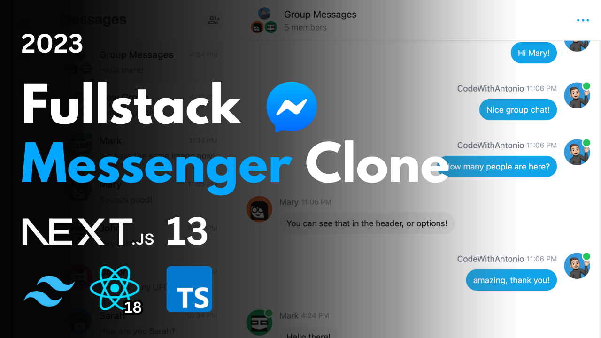

# Clone Messenger Real-Time: Next.js 13, React, Tailwind, Prisma, MongoDB, NextAuth, Pusher (2023)

# Projeto em desenvolvimento

## Sobre o projeto

Desenvolvimento do aplicativo Messenger do Facebook, usando as últimas tecnologias de desenvolvimento web. Esse projeto fullstack, aborda desde as funcionalidades visuais do projeto, bem como todo o compartamento de chat.

## Principais funcionalidades:

- Mensagens em Real-time usando Pusher;
- Notificações e mensagens de alertas;
- TailwindCSS para desenvolvimento de toda UI;
- Animações TailwindCSS e efeitos de transição;
- Responsivo para todos os dispositivos;
- Autenticação de credenciais utilizando NextAuth;
- Integração com Autenticação Social com Google;
- Integração com Autenticação Social com Github;
- Upload de arquivos e imagens utilizando o CDN Cloudinary;
- Validação de formulários usando react-hook-form;
- Handling de erros, utilizando o react-toast;
- Leitura de mensagens;
- Status Online/offline de usuários;
- Grupos de chats e mensagem individuais;
- Anexos de mensagens e compartilhamento de arquivos;
- Customização do perfil do usuário e configurações;
- API Routes POST, GET, e DELETE (app/api);
- Como persistir dados em React Server components acessando o banco de dados diretamente (SEM API!);
- Lidando com relacionamentos entre Server e componentes filhos em ambiente Real time;
- Criação e gerenciamento de chats e grupos de conversa.
